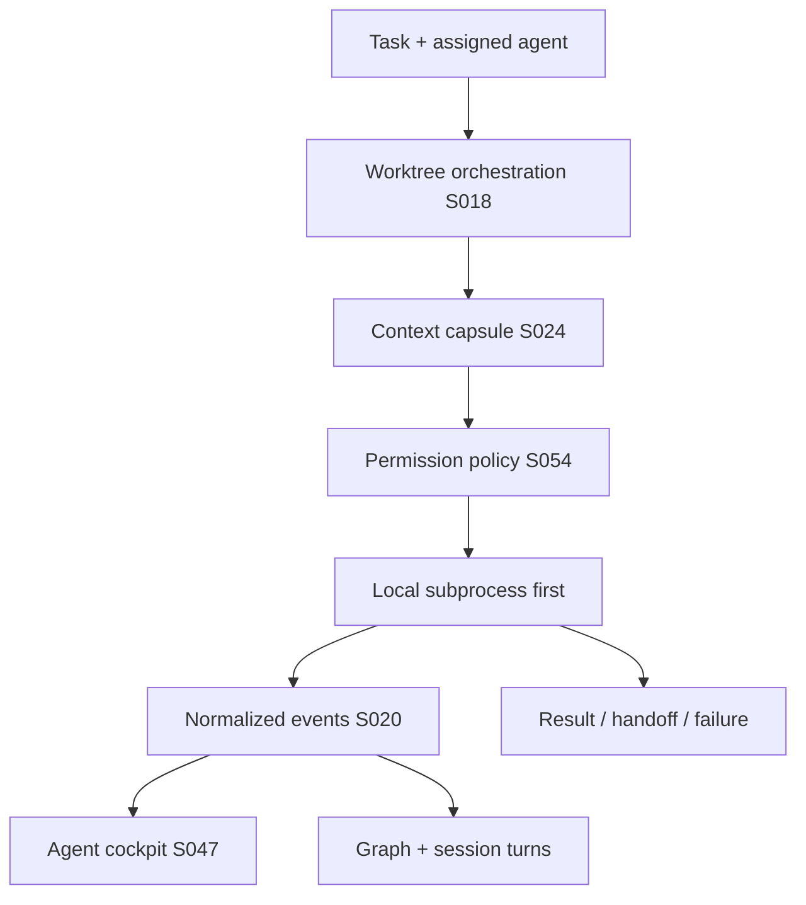

# Agent runtime

An agent execution is a first-class object with provider, model, task, context capsule, working directory, worktree, environment, permissions, process, status, token usage when available, cost when available, events, and result.

The `rune-agent-runtime` and `rune-worktrees` crates are specified and are not yet workspace members.

## Execution

Support local subprocess-based coding agents first where their CLIs allow it. The runtime must be extensible to remote agents. Do not grant unrestricted permissions by default.

## Event normalization (S020)

Observable events normalize into: thinking, search, read, write, command, test, error, warning, decision, question, result, handoff, completion.

The UI renders normalized events consistently. Raw provider output is preserved separately.

## Communication policy (S029)

Presentation modes: `full`, `concise`, `minimal`, `machine`. These control communication presentation, not reasoning quality. Machine mode prioritizes structured events.

## Worktrees (S018)

Each agent task may receive an isolated worktree. Track task, agent, branch, worktree, base commit, current commit, working state, processes, tests, handoffs.

Detect abandoned and stale worktrees. Do not delete user work without explicit approval.

## Cockpit (S047)

Specified agent card: provider, model when available, task, worktree, branch, current action, context usage, tests, status, elapsed time, recent events. Navigation into the event stream is required.
