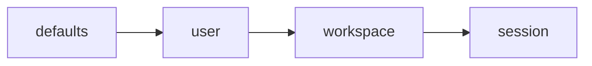

# Configuration

Specified layered configuration (S070). `rune-core` already defines `ConfigLayer::{Defaults, User, Workspace, Session}` and `LayeredConfig`, where later layers override earlier layers for the same key.

Runtime config crates and on-disk loaders are not implemented yet. This document is the contract those crates must follow.

## Layers (lowest to highest precedence)



| Layer | Specified location | Purpose |
| --- | --- | --- |
| defaults | compiled / packaged defaults | Safe local-first policy, default theme, default budgets |
| user | `~/.config/rune/config.toml` (XDG on Linux; platform equivalent elsewhere) | User-wide theme, keys, providers, motion |
| workspace | `<repo>/.rune/config.toml` | Repository policy, security, indexing, agent adapters |
| session | process flags / ephemeral overlay | One-run overrides; not persisted as user preference |

Exact filenames may evolve. The four-layer rank must not.

## Required domains (S070)

theme, motion, keybindings, providers, agent adapters, search behavior, semantic providers, memory behavior, context budgets, security policy, plugins, external documentation, workspace rules.

## Example: user

```toml
# ~/.config/rune/config.toml  (example; loader not shipped yet)

[theme]
name = "default"
high_contrast = false

[motion]
reduced = false

[search]
default_mode = "hybrid"

[semantic]
mode = "disabled"

[security]
network_enabled = false
auto_execute_commands = false
```

## Example: workspace

```toml
# .rune/config.toml  (example; loader not shipped yet)

[index]
ignore = ["target/", "node_modules/", "dist/"]

[memory]
auto_verify_agent_inferences = false

[context]
budget_tokens = 32000

[agents]
default_provider = "claude-code"

[docs]
warn_on_version_mismatch = true
```

## Example: session

```text
rune search --mode structural "TokenStore"
rune context --budget 8000 --exclude-category conversation
```

Session flags override workspace and user for that invocation only. Temporary exclusions must not be written back as workspace preferences (S094).

## Security defaults

Local default policy (already sketched in `rune-security`) allows filesystem read and requires explicit confirmation for write, process execution, network, plugin load, MCP tools, agent subprocesses, worktree mutation, and export. Network is off. Automatic command execution is off.

Retrieved text never changes these permissions (DEC-007).

## Secrets

Never persist secrets in plaintext memory (S053). Configuration files must not be a second secret store. Environment facts that are non-secret may be project-scoped.
