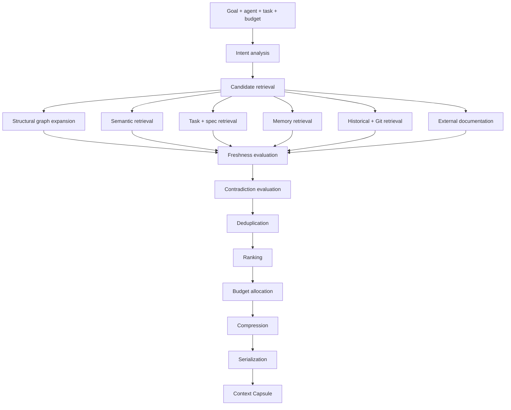

# Context compiler

The Context Compiler is specified as a core differentiating system. It receives a goal, agent, task, repository state, token budget, and optional user constraints. It produces a structured **Context Capsule**, not a vector-search dump.

The `rune-context-compiler` crate is specified and is not yet a workspace member.

## Pipeline

Every included object must log why it was selected (S024, S089, S092).

## Capsule fields (specified)

identifier, goal, task, agent, created_at, repository_state, budget, summary, requirements, current_state, relevant_code, structural_context, tests, memory, history, decisions, failed_attempts, external_documentation, working_tree, constraints, open_questions, recommended_next_actions, provenance.

Use a structured machine representation with a separate human renderer.

## Scoring signals (S025)

query relevance, structural proximity, task relevance, specification relevance, temporal relevance, memory validity, source confidence, historical importance, test relevance, Git proximity, agent compatibility, redundancy penalty, staleness penalty, contradiction penalty.

Weights are configurable. Evaluation data should determine defaults. An optimization that lowers tokens while materially reducing evidence recall is a regression (S063).

## Budget categories (S026)

task, specification, code, structure, memory, history, tests, documentation, Git, conversation.

Allocation adapts to task type. A debugging task prioritizes failures, tests, code, and history. An architectural task prioritizes specifications, semantic graph, decisions, dependencies, and history.

## User controls

- Pin objects so they survive ordinary ranking until unpinned; warn if pinned context becomes stale or contradicted (S093).
- Exclude objects or categories for the appropriate scope only; do not silently promote temporary exclusions into permanent preferences (S094).
- Compare capsules: added/removed objects, changed memories, different allocation (S090).
- Inspect provenance: source, retrieval path, reason selected, confidence, freshness, token cost (S092).
