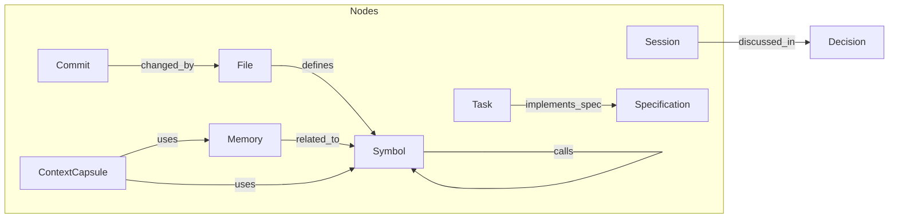
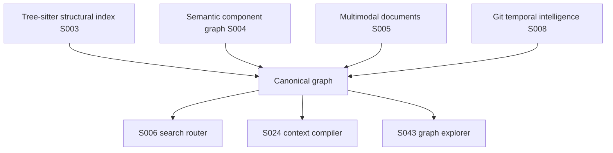

# Graph architecture

The canonical information model is: **everything is an object, every object can have relationships, every object can have actions, every object can contribute context.**

Storage is SQLite `nodes`, `edges`, and `provenance` tables with JSON payloads (DEC-002). Identifiers are UUID v7. Content is Blake3-hashed. Line numbers are locators, not identities (DEC-003).

`rune-graph` exposes neighborhood expansion and path tracing over `rune-storage`. Semantic component summaries (S004), multimodal documents (S005), Git-anchored history (S008), and cross-file call edges (DEC-012) are implemented and in verification. Neural embeddings remain optional (DEC-010).

## Model

Node kinds include the set in `rune_core::NodeKind` (Project, File, Symbol, Session, Memory, Task, Handoff, ContextCapsule, and others). Unknown future kinds deserialize as `NodeKind::Unknown` so the database does not require redesign.

Edges carry `EdgeKind` plus metadata: confidence, source, timestamp, provenance, version, validity, weight.

## Provenance

No synthesized fact may exist without provenance. Derived facts must be distinguishable from verified facts. The compiler and UI must never present an inferred statement as directly observed truth.

## Query surfaces (specified)

| Operation | Purpose |
| --- | --- |
| Neighbors | Expand a node by edge/node kind and depth |
| Path | Trace a typed path between two nodes |
| Structural | Callers, callees, imports, implementations, tests |
| Temporal | Commits, branches, worktrees, stale memories after a diff |
| Integrity | Dangling edges, duplicates, orphaned references (S100) |

## Layers

Semantic descriptions cannot replace symbol indexing. Structural features must remain available when semantic providers are disabled (DEC-005).
