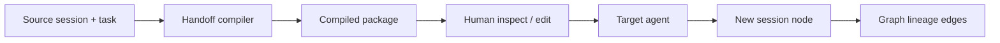

# Handoff

Cross-agent handoff is specified as a first-class graph object, compiled rather than pasted as a full transcript.

The `rune-handoff` crate is specified and is not yet a workspace member.

## Handoff object (S021)

A handoff contains: source agent, target agent, goal, current state, task, working tree state, diff, relevant files, relevant symbols, decisions, failed attempts, unresolved questions, remaining work, tests, constraints, memories, historical context, environment information, recommended next actions.

Lineage is tracked:

```text
session A → handoff → session B → handoff → session C
```

## Compiler (S022)

Handoffs use the same retrieval machinery as normal context compilation. Users inspect and edit the package before transfer.

Modes: `full`, `balanced`, `compact`, `custom`.



## Evaluation (S064)

Specified measures: whether the receiving agent correctly understands goal, current state, completed work, failed approaches, constraints, remaining tasks, relevant files, and tests. Structured handoff is compared against raw transcript handoff.

## Knowledge comparison (S091)

Compare observable supplied context and session history between agents. Do not claim internal model knowledge beyond what was given or recorded.
