# Memory lifecycle

Persistent project memory is evidence with a lifecycle. It is not hidden authority. Every memory must remain inspectable, editable, invalidatable, and removable.

The `rune-memory` crate is specified and is not yet a workspace member. Types for validity already exist in `rune-core`.

## Record

Every memory stores: identifier, statement, type, scope, confidence, evidence, related nodes, created time, last verified time, validity state.

Categories include architectural decision, project constraint, developer preference, verified fact, workflow convention, failure pattern, successful procedure, environment detail, temporary context, and external dependency fact.

## States

```mermaid
stateDiagram-v2
    [*] --> candidate: extraction from session, commit, spec, human, test
    candidate --> verified: human or corroborating evidence
    verified --> stable: repeated confirmation
    verified --> stale: supporting code or spec changed
    stable --> stale: supporting code or spec changed
    stale --> contradicted: conflicting evidence
    stale --> verified: re-verified
    verified --> superseded: replacement memory
    stable --> superseded: replacement memory
    contradicted --> superseded: replacement memory
    candidate --> archived: rejected or expired
    stale --> archived: historical only
    superseded --> archived: historical only
    archived --> [*]
```



Agent guesses must never automatically become verified memories (S012, DEC-007). Human decisions outrank agent inferences (S095).

## Extraction sources (S012)

agent sessions, commits, specifications, human statements, test outcomes, architecture decisions, repeated procedures.

Extraction must distinguish observed fact, human preference, agent inference, and temporary assumption.

## Freshness (S013)

When code, specifications, dependencies, or related facts change, inspect affected memories. Classify: possibly stale, likely contradicted, still supported, superseded. Users must be able to inspect why a memory changed state.

Example shape:

```text
Memory: Authentication uses Redis sessions
Previously verified: commit abc123
Relevant code changed: commit def456
Current state: stale
Affected symbols: SessionStore, AuthenticationService
```

Stale memory can be shown historically. It must not silently guide current agent behavior as if verified.

## Conflict (S096)

When sources disagree: preserve both claims, record evidence, mark conflict, rank by authority and freshness, surface the conflict. Never silently overwrite conflicting knowledge.

## Timeline view (S045)

The specified Memory Timeline shows creation, verification, staleness, contradiction, supersession, and archival, with navigation to supporting evidence.
