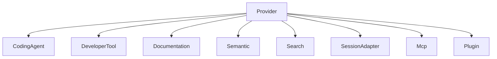

# Provider architecture

External tools are implementation providers. Rune is the system of record.

`rune-providers` already defines `Provider`, `ProviderIdentity`, `Capability`, and request/response types. Concrete adapters are not implemented.

## Trait (specified)

```rust
pub trait Provider {
    fn identity(&self) -> ProviderIdentity;
    fn capabilities(&self) -> Vec<Capability>;
}
```

Async operations may include query, execute, stream, inspect, export, import. The capability model must remain stable even if Rust interfaces evolve (S033, DEC-008).

## Kinds



Capabilities include Query, Execute, Stream, Inspect, Export, Import, SessionDiscovery, SessionImport, SessionContinuation, ContextInjection, CommandInvocation, Handoff, StreamingEvents, Embed, Complete.

Missing tools produce structured errors, not silent fallbacks. UI and runtime hide or disable unsupported actions.

## Semantic providers (S059)

Do not bind the architecture to one embedding model or language model. Support local embedding, remote embedding, local language model, remote language model, and disabled semantic mode. Structural functionality remains available without external AI services (DEC-005). Stored embeddings are provider-scoped and must not be mixed across incompatible models.

## MCP (S036)

Discover configured MCP servers where appropriate. Represent servers, tools, resources, prompts, capabilities, and permissions. MCP results enter the same provenance model. External MCP content must never automatically become trusted memory.

## Plugins (S037)

Plugins may contribute providers, commands, search sources, node types, edge types, renderers, actions, session adapters, documentation adapters, agent adapters, and exporters.

Plugins declare permissions. They must not receive unrestricted filesystem or process access by default.

## Tool adapters (S035)

Specified candidates: git, gh, ripgrep, fd, bat, jq, curl, Docker, kubectl, SSH, Cargo, npm, pnpm, bun, uv, Python, Go, Homebrew, hyperfine.

Prefer structured output when available. Do not parse decorative terminal output if a machine-readable format exists.
