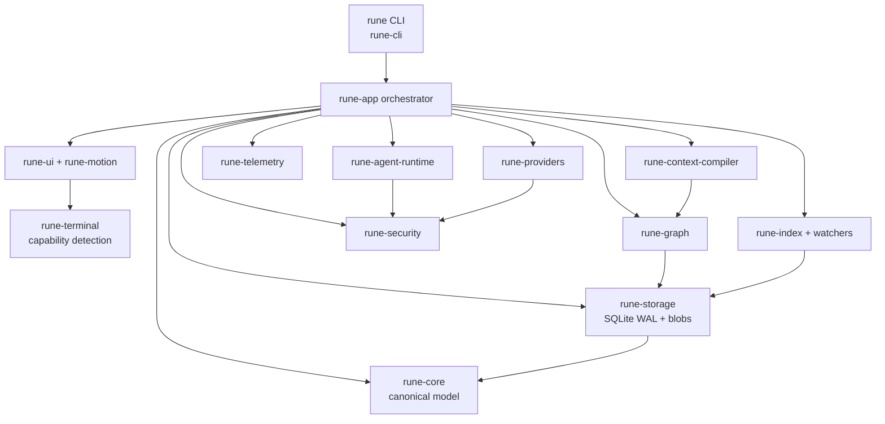

# Runtime architecture

Specified orchestrator for a local-first Context OS. `rune-app` (planned) owns process lifetime. Domain crates remain renderer-free (DEC-006).

## Process layout

## Responsibilities

| Surface | Specified owner | Current repo |
| --- | --- | --- |
| CLI grammar | `rune-cli` | not yet a workspace member |
| Orchestration, event loop | `rune-app` | not yet a workspace member |
| Canonical types | `rune-core` | present |
| Persistence | `rune-storage` | present |
| Graph queries | `rune-graph` | present |
| Permissions | `rune-security` | present |
| Tracing | `rune-telemetry` | present |
| Provider traits | `rune-providers` | present |
| Terminal capabilities | `rune-terminal` | present |
| TUI | `rune-ui`, `rune-motion` | not yet members |

## Runtime loop

1. Discover workspace and existing `.rune/` state (S001).
2. Open the SQLite store with WAL and run migrations (S056, S057).
3. Detect terminal capabilities and select a renderer level (S002).
4. Start background indexing and file watching without blocking input (S098, S099).
5. Serve the TUI or a noninteractive CLI command.
6. On agent invocation, compile a Context Capsule, spawn the agent under policy, ingest events, update the graph.

One failed integration must not corrupt global state (S068). Network features fail clearly when offline (S060). Secrets are never logged (S061, S053).

## Isolation

Agents receive only the permissions required for the task (AGENTS.md §116). Review agents are specified as read-only. Implementation agents write inside an assigned worktree. Automatic process cleanup applies only to processes Rune launched under an isolated runtime configured for it.
