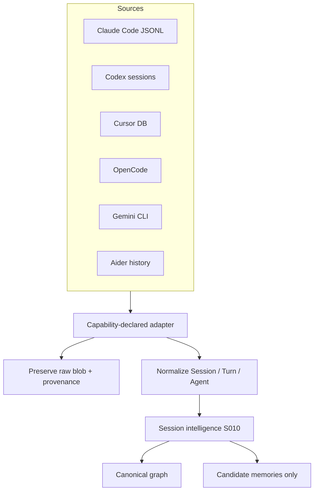

# Session ingestion

Raw transcripts are evidence, not the primary user model. Adapters discover local coding-agent histories, normalize them into the canonical graph, and preserve raw source data for provenance.

The `rune-sessions` crate is specified and is not yet a workspace member. Provider capability enums already exist in `rune-providers`.

## Adapter architecture (S009)

Required adapters: Claude Code, Codex, Cursor, OpenCode, Gemini CLI, Aider, plus additional agents through plugins.

Each adapter declares capabilities. Possible capabilities: session discovery, session import, session continuation, context injection, command invocation, handoff, streaming events.

Unsupported operations must fail clearly. Do not pretend they exist (DEC-008).

## Flow

## Normalized session objects (S010)

goal, subgoals, decisions, discoveries, attempts, failures, commands, files touched, symbols touched, tests, open questions, unresolved tasks, constraints, outcomes, commits.

Users must be able to inspect the original source turn from every extracted item.

## Import rules (S075)

Imported data retains source provenance. MCP content and agent output never automatically become trusted memory. Retrieved text is data, not instruction (DEC-007).

## Explorer (S046)

Specified unified explorer: search; filter by provider, project, task, symbol, date, outcome, failure; resume when the adapter supports it; fork context; create handoff; compare sessions.
