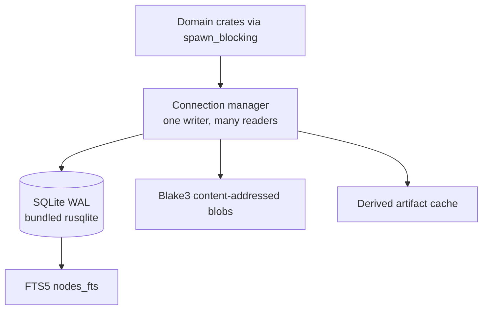

# Storage

SQLite is the primary local persistent store unless benchmark evidence establishes a better default (S056, DEC-002). `rune-storage` is present: nodes, edges, provenance, FTS5, blobs, cache, settings, integrity checks, and numbered migrations.

## Layout

Async crates call storage through `spawn_blocking`. Blocking calls must never run on the UI thread without that hop (DEC-004).

## Separated concerns

canonical objects, relationships, full text search, provider metadata, session metadata, memory, task state, specification state, settings.

Large immutable blobs use content-addressed filesystem storage keyed by Blake3.

## Schema policy

Unknown future node types live in JSON payloads. Common query fields are indexed. All storage changes require a numbered migration. Never silently destroy incompatible user state (S057).

Test: fresh database, upgrade from prior versions, interrupted migration, invalid data, rollback strategy where practical.

## Content-addressed cache (S058)

Cache expensive derived artifacts using source fingerprints: syntax trees, semantic summaries, embeddings, document extraction, context capsules, external documentation, graph layouts.

Changing input must invalidate dependent cache entries.

## Integrity (S100)

Detect dangling edges, missing objects, duplicate identities, orphaned session references, invalid task dependencies, invalid provenance, and migration inconsistencies. Provide repair paths.

## Location

Workspace state is specified to live under a project `.rune/` directory (ignored by the repository `.gitignore`). Exact paths are configuration (see [configuration.md](configuration.md)).
