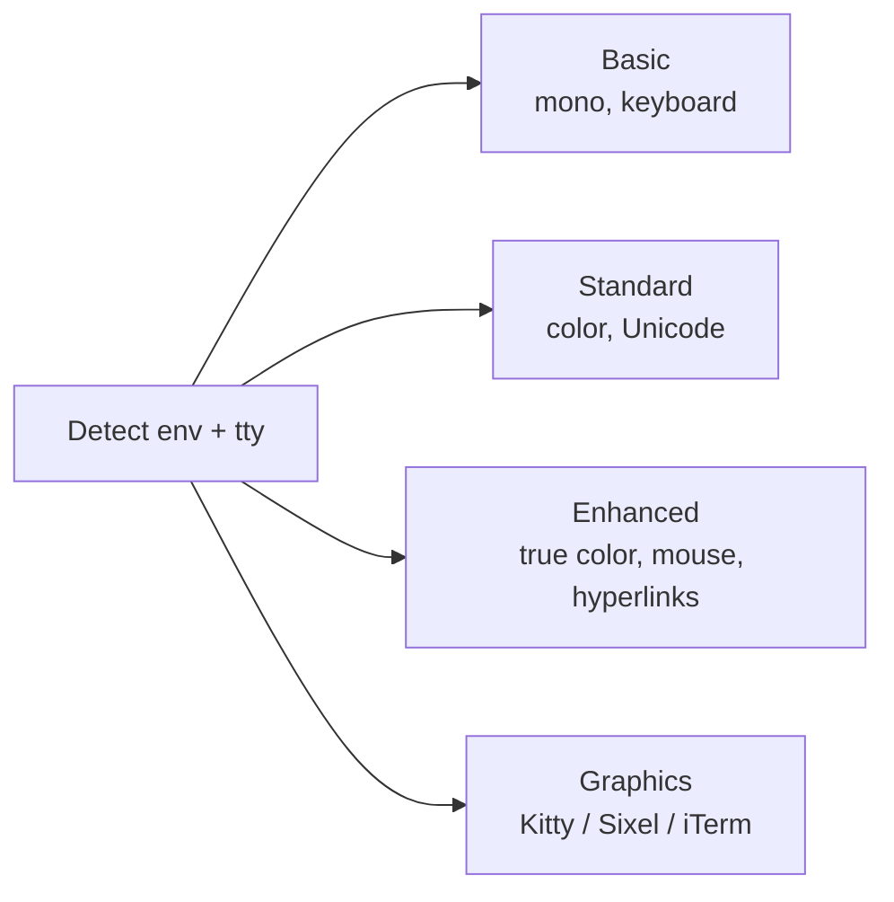

# TUI rendering

The terminal interface is primary. Domain state is not owned by Ratatui (DEC-006). `rune-ui` and `rune-motion` consume snapshots. `rune-terminal` owns capability detection and backend I/O.

`rune-terminal` currently detects renderer levels. `rune-ui` and `rune-motion` are not yet workspace members.

## Capability levels (S002)

Detect: true color, Unicode quality, mouse, hyperlinks, synchronized output, Kitty graphics, Sixel, iTerm graphics, terminal cells, pixel dimensions when available.

No supported terminal may become unusable merely because advanced graphics are unavailable.

## Design system (S039)

Semantic tokens: surface, elevated surface, border, primary/secondary/muted text, accent, success, warning, error, selection, focus.

Typography roles: title, section, body, muted, code, status, key hint.

Do not place borders around every component. Use spacing, contrast, alignment, and hierarchy.

## Motion (S040, S041, S042)

Shared motion: fade, slide, reveal, crossfade, spring, stagger, color interpolation, gradient sweep, character dissolve, border trace, highlight pulse, shared element movement.

Respect reduced motion. Decorative motion stays restrained.

Rendering is event-driven while static. Ordinary motion approximately 30 fps. High-fidelity transitions up to approximately 60 fps. Use buffer diffing and synchronized updates where supported.

Shared-element transitions track old/new rectangle and style, progress, and easing. Fallback cleanly when animation is disabled.

## Views (specified)

| View | Spec |
| --- | --- |
| Command palette | S038 |
| Graph explorer | S043 |
| Context inspector | S044 |
| Memory timeline | S045 |
| Session explorer | S046 |
| Agent cockpit | S047 |
| Task graph | S048 |
| Specification coverage | S049 |

The command palette searches commands, files, symbols, tasks, specifications, memories, sessions, agents, commits, branches, issues, pull requests, documentation, processes, ports, containers, remote hosts, packages, and tools.

## Accessibility (S073)

Reduced motion, high contrast, color-independent status cues, keyboard-only navigation, screen-size adaptation. Important state must never rely solely on color.

## Themes and keys (S071, S072)

Themes use semantic tokens, not component-specific colors. Users can create themes without recompiling. Keybindings bind components to semantic actions, not hard-coded keys, with conflict detection.
